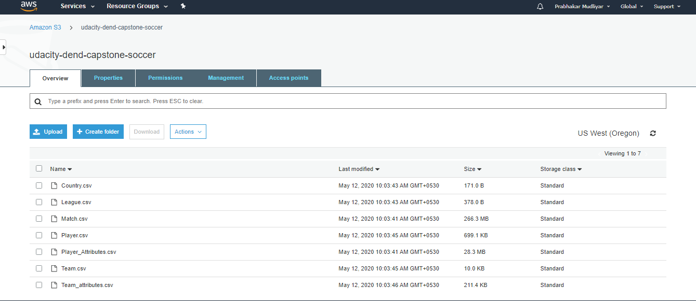
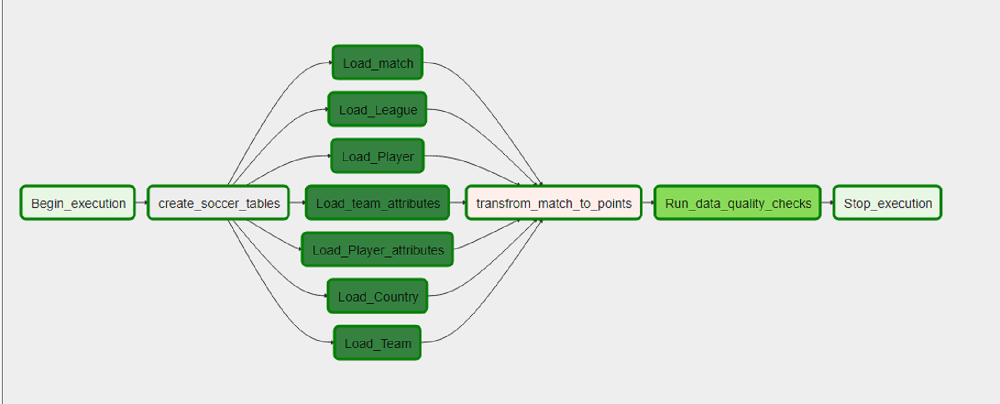

# Soccer Leagues Points
### Data Engineering Capstone Project

#### Project Summary
European Soccer Database consist of all the matches players from Season 2008 to 2016. Dataset has many different tables we will have to understand and gather meaningful insights and transform the data to fetch the league points table at every stage of the respective season for the leagues.

The project follows the follow steps:
* Step 1: Scope the Project and Gather Data
* Step 2: Explore and Assess the Data
* Step 3: Define the Data Model
* Step 4: Run ETL to Model the Data
* Step 5: Complete Project Write Up

### Step 1: Scope the Project and Gather Data

#### Scope 
The scope of the Project is to build a Data Pipeline using Apache Airflow to build pipeline of tasks which include create tables, load the staging tables to Amazon Redshift, transfrom the staging tables using Pandas and load the transformed data back to Amazon Redshift.
Raw match data consist of all the +25000 matches played from the season 2008 to 2016 in all the 11 European Countries, we need to calculate the points earned by teams in a single match for each stage. 
For each match played, a team with the more no of goals than the other will earn 3 points, if it is a draw then it will 1 point else if team losses then it 0 point.
A stage represents matches played in a single week of season by all the teams in a single league. So will try to transform data so that we can check at which week(stage) of the season how much points were earned by the team. This data will then be used to analyse the performance of the team.

#### Describe and Gather Data 

The dataset used in this project comes from the Kaggle's European Soccer Database as you can see below image which lists all the tables. But it is sqllite database, so for convenience I converted the dataset to csv of respective table and uploaded it to S3 as shown in the second image.

This dataset includes the following:
1. +25,000 matches
2. +10,000 players
3. 11 European Countries with their lead championship
4. Seasons 2008 to 2016
5. Players and Teams' attributes* sourced from EA Sports' FIFA video game series, including the weekly updates
6. Team line up with squad formation (X, Y coordinates)
7. Betting odds from up to 10 providers
8. Detailed match events (goal types, possession, corner, cross, fouls, cards etc…) for +10,000 matches

### Step 3: Define the Data Model
#### 3.1 Conceptual Data Model
The Data Model which we used to model the data in our Data Warehouse will be the star schema. After analysing the data we can come to the conclusion that we will map our data model as follows
1. Country -> Dimensions Table
2. League -> Dimensions Table
3. Team -> Dimensions Table
4. Team_attributes -> Dimensions Table
5. Player -> Dimensions Table
6. Player_attributes -> Dimensions Table
7. Match -> Fact Table

After staging our data from S3 to Amazon Redshift, we will transform our Match table to Points table. 
8. Points -> Points Table

Our *Points* table will have following columns.
1. league_id int4,
2. league_name TEXT,
3. season TEXT,
4. table_position int4,
5. team_name_stats TEXT,
6. W int4,
7. D int4,
8. L int4,
9. GF int4,
10. GA int4,
11. GD int4,
12. cum_points NUMERIC 

#### 3.2 Mapping Out Data Pipelines

We will be using Apache Airflow for Data Pipeline. Airflow will help us map out each and every steps and create a pipeline whenever necessary.
Our Data Pipeline will have the following DAG's as shown in the below image.

### Run Pipelines to Model the Data 
#### 4.1 Create the data model
Our DAG (udacity_capstone_soccer.dag)  consist of 13 tasks, each of tasks working is given below.

**DAG Creation**: First we create our DAG using the following the params and DAG class.